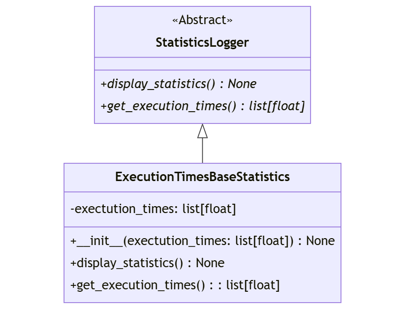

# Wzorce Projektowe i Zasady SOLID

## Zadanie

Dla klasy `ExecutionTimesBaseStatistics` (przedstawionej na schemacie), która dziedziczy po klasie `StatisticsLogger`, stwórz dwa dekoratory obiektowe z następującymi funkcjonalnościami:

1. **WithMeanStatisticsLogger** - dekorator, który będzie wyświetlać średnią rezultatów (`execution_times`) przed wyświetlaniem poszczególnych rezultatów.
2. **WithSummaryStatisticsLogger** - dekorator, który będzie wyświetlał przed poszczególnymi rezultatami następujące dane: liczbę rekordów, sumę ich wartości, wartość minimalną i wartość maksymalną.

Następnie, te same funkcjonalności proszę zaprogramować jako dekoratory funkcyjne w Pythonie.

## Wymagania

1. **Implementacja diagramu klas** - 3 pkt.
2. **Implementacja dekoratorów (obiektowo)** - 4 pkt.
3. **Implementacja dekoratorów (funkcyjnie)** - 4 pkt.
4. **Testy dla implementacji diagramu klas** - 2 pkt.
5. **Czysty kod, typowanie** - 2 pkt.

## Dodatkowe zadanie na ocenę celującą

- Dodaj testy dla dekoratorów.

## Diagram klas

## Uwagi

W kodzie klienckim należy zaimplementować użycie zaprogramowanych dekoratorów. Dekoratory mają na celu dodanie dodatkowych funkcjonalności, takich jak obliczanie średniej wartości `execution_times` lub podanie szczegółowych statystyk (liczba rekordów, suma, minimalna i maksymalna wartość) przed wyświetleniem wyników.

---
